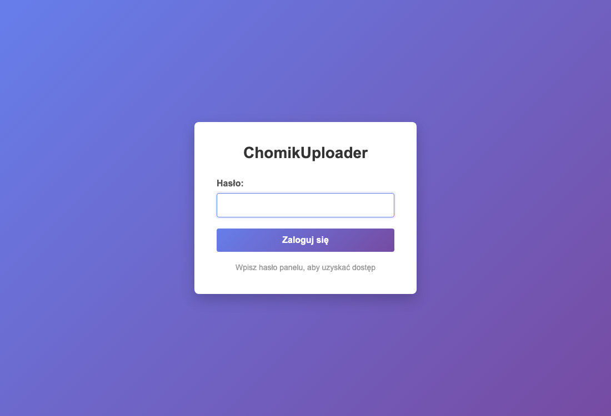
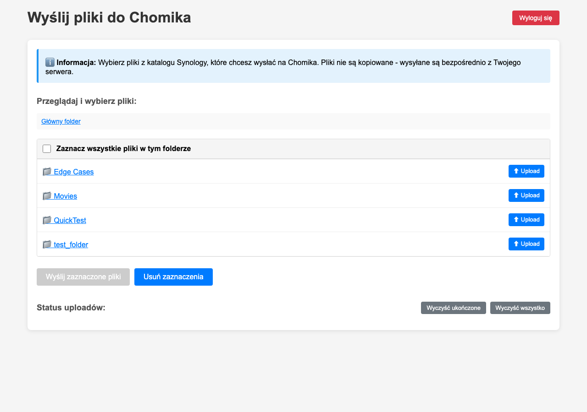
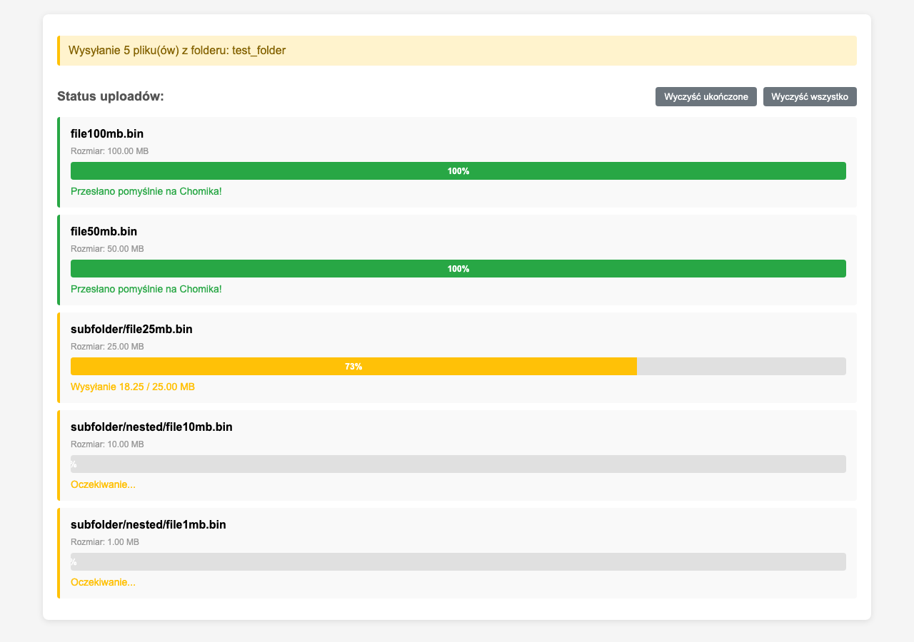

# ChomikUploader

ChomikUploader to wygodny, bezpieczny panel webowy do przesyłania plików bezpośrednio na konto Chomikuj.pl. Powstał z myślą o Synology NAS, ale uruchomisz go wszędzie tam, gdzie działa Docker (Linux, macOS, Windows, Raspberry Pi, mini PC, VPS).

## Kluczowe funkcje

- Przeglądanie folderów NAS z nawigacją po katalogach
- Wybór i wysyłanie pojedynczych plików bezpośrednio na Chomikuj
- Upload całego folderu razem z podfolderami (struktura zachowana po stronie Chomika)
- Postęp uploadu na żywo z paskiem postępu dla każdego pliku
- Przyciski czyszczenia listy statusów (osobno dla ukończonych i osobno dla wszystkich)
- Pliki są widoczne tylko do odczytu, nie są kopiowane ani zapisywane lokalnie
- Bezpieczny dostęp chroniony hasłem
- Pojedynczy kontener Docker, działa na Synology, Linuksie, macOS, Windowsie, Raspberry Pi

---

## Zrzuty ekranu

### Logowanie


### Przeglądarka folderów
Każdy folder ma przycisk **⬆ Upload**, który wysyła cały folder razem z zawartością.



### Status uploadów
Postęp dla każdego pliku z osobna, przyciski czyszczenia listy po prawej stronie.



---

## Instalacja

### 1. Przygotuj folder z plikami
Wybierz katalog, z którego chcesz wysyłać pliki. Może być dowolne miejsce na dysku:
- Synology: np. `/volume1/shared`
- Linux/macOS: np. `/home/user/uploads` albo `/Users/janek/movies`
- Windows: np. `C:/Users/janek/uploads`
- Raspberry Pi z dyskiem USB: np. `/mnt/usb/media`

### 2. Stwórz plik `docker-compose.yml`

```yaml
services:
  chomik-uploader:
    image: ghcr.io/pawisoon/chomik-web-uploader:latest
    container_name: chomik-uploader
    ports:
      - "8000:5000"
    environment:
      - PANEL_PASSWORD=twoje_haslo_do_panelu
      - SECRET_KEY=losowy_silny_klucz_min_32_znaki
      - CHOMIK_USERNAME=twoj_login_chomikuj
      - CHOMIK_PASSWORD=twoje_haslo_chomikuj
      - CHOMIK_DEST=/Moje_Uploady
    volumes:
      - /volume1/shared:/app/browse:ro                   # podmień na swoją ścieżkę
      - /volume1/docker/chomik-uploader/data:/app/data   # historia uploadów (checksumy) — MUSI być trwały wolumen
    restart: unless-stopped
    security_opt:
      - no-new-privileges:true
```

**Uwaga:**
- `SECRET_KEY` powinien być długi i losowy (np. `openssl rand -base64 32`)
- Dane logowania do Chomikuj możesz trzymać w `.env`
- `/app/data` **musi** być na trwałym wolumenie — to tam trzymana jest historia uploadów
  (checksumy plików), dzięki której panel nie wysyła ponownie raz wgranych plików. Bez tego
  wolumenu historia znika przy każdym redeployu/restarcie kontenera (np. w Portainerze).
  Zamiast ścieżki absolutnej możesz użyć nazwanego wolumenu — dodaj `- chomik-data:/app/data`
  oraz na końcu pliku blok:
  ```yaml
  volumes:
    chomik-data:
  ```

### 3. Uruchom kontener

- **Synology / Portainer:** Skopiuj treść `docker-compose.yml`, dodaj stack, uzupełnij zmienne środowiskowe, Deploy
- **Wszędzie indziej (SSH/terminal):**
```bash
cd /ścieżka_do_katalogu/
docker compose up -d
```

### 4. Logowanie

- Wejdź na `http://adres-twojej-maszyny:8000` (np. `http://twoje-nas:8000` albo `http://localhost:8000` przy uruchomieniu lokalnym)
- Zaloguj się hasłem panelu

### 5. Używanie

- Przeglądaj foldery jak w eksploratorze plików, klikaj nazwę żeby wejść do środka
- Zaznacz checkboxami pojedyncze pliki i kliknij **Wyślij zaznaczone pliki**
- Albo kliknij **⬆ Upload** obok folderu, żeby wysłać cały folder razem z podfolderami
- Po stronie Chomika powstanie folder o tej samej nazwie i z tą samą strukturą podfolderów
- Status uploadu z paskiem postępu pojawia się dla każdego pliku z osobna
- **Wyczyść ukończone** chowa pomyślnie przesłane wpisy i zostawia błędy
- **Wyczyść wszystko** czyści cały panel statusów

---

## Bezpieczeństwo
- Panel dostępny tylko po zalogowaniu
- Pliki zawsze w trybie read-only (nie są nadpisywane ani kasowane)
- Folder montowany tylko w trybie odczytu
- Brak zapisywania jakichkolwiek plików w kontenerze

---

## FAQ
- **Błąd portu?** Jeśli 8000 zajęty, zmień na np. "8001:5000" w docker-compose.yml
- **Folder się nie tworzy na Chomiku?** Sprawdź czy `CHOMIK_DEST` nie zawiera znaków specjalnych. Domyślnie `/Moje_Uploady`
- **Upload utknął na 0%?** Po stronie Chomika może być chwilowy problem z autoryzacją, restart kontenera zazwyczaj pomaga

---

### Autor
pawisoon

PRy mile widziane. Masz problem lub pytania? Otwórz issue na GitHub.

---

MIT License
